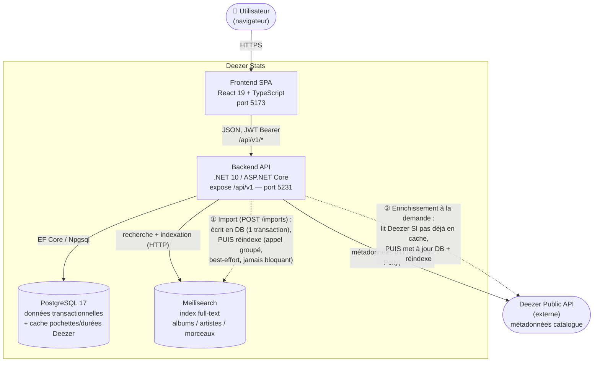
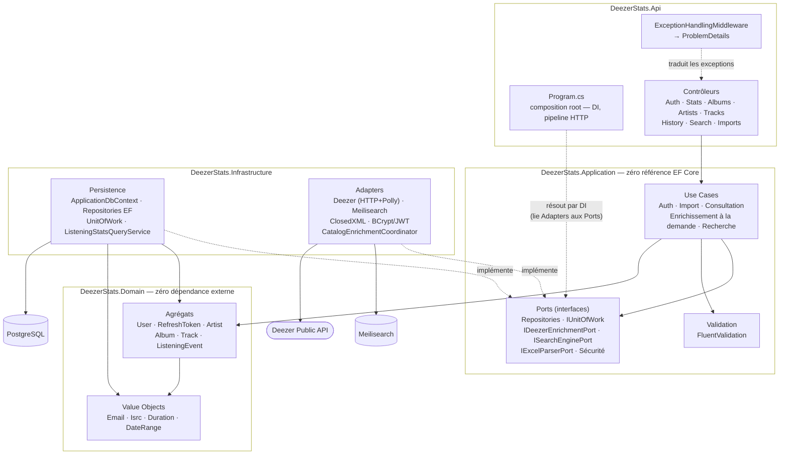
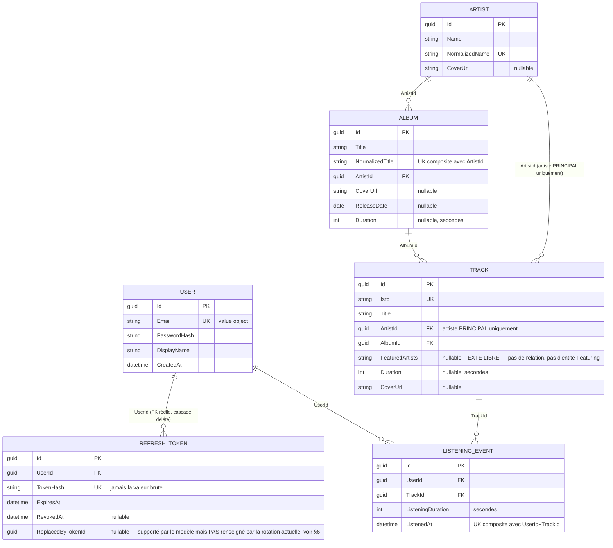
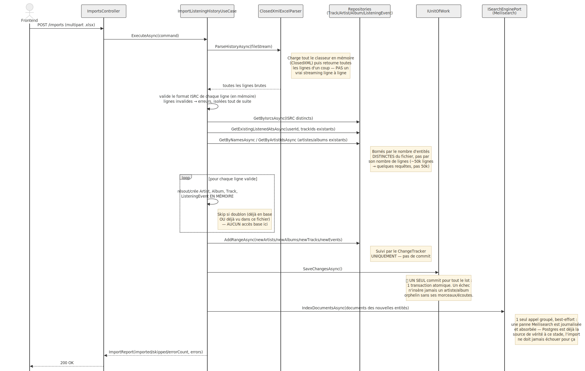
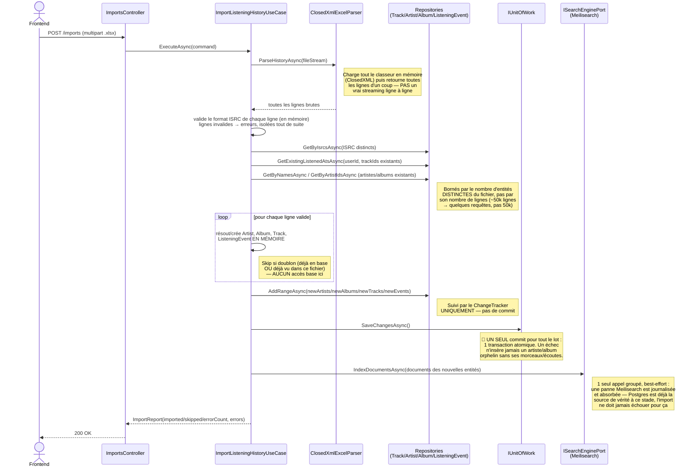
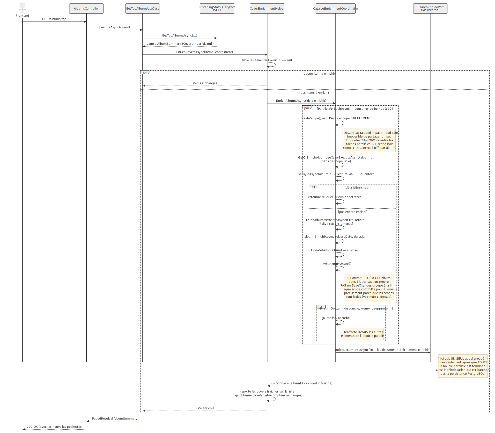
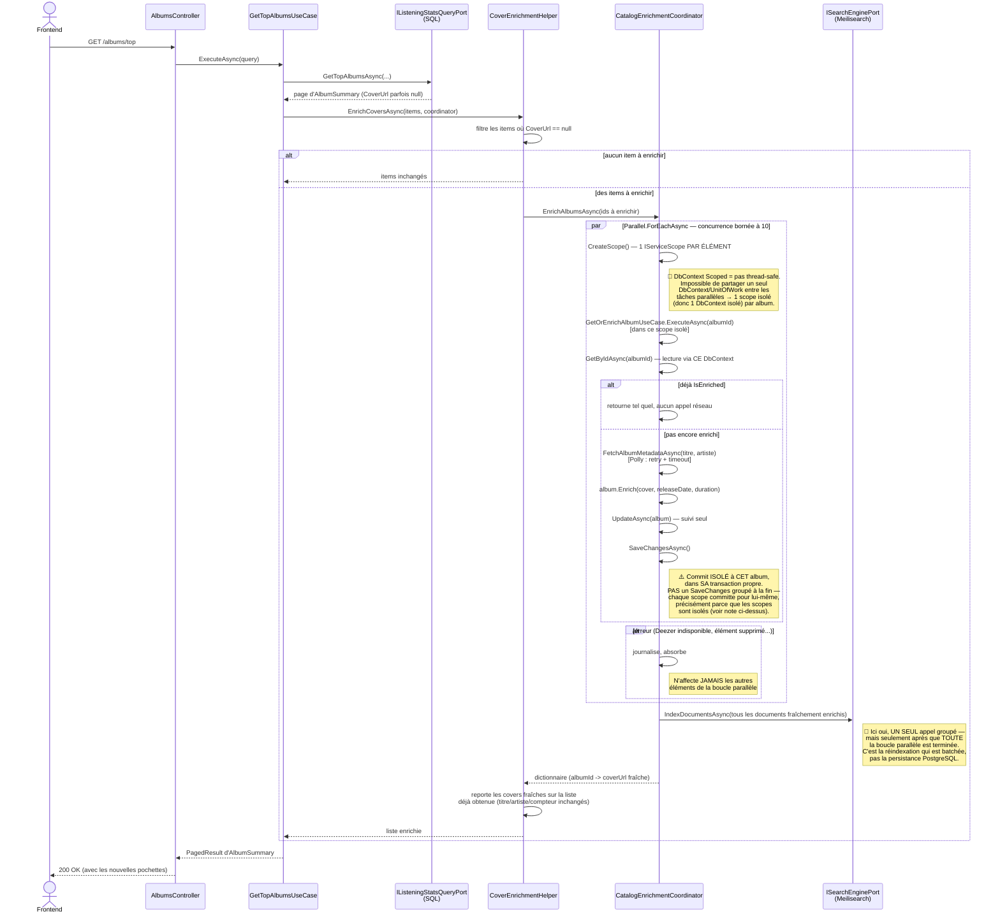
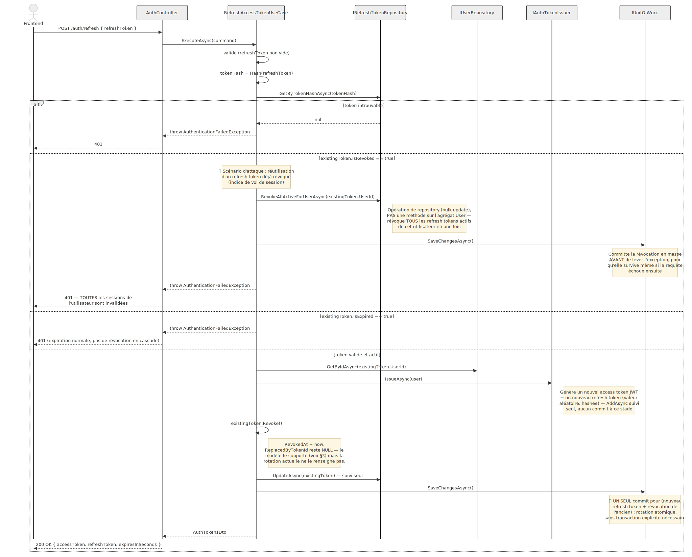
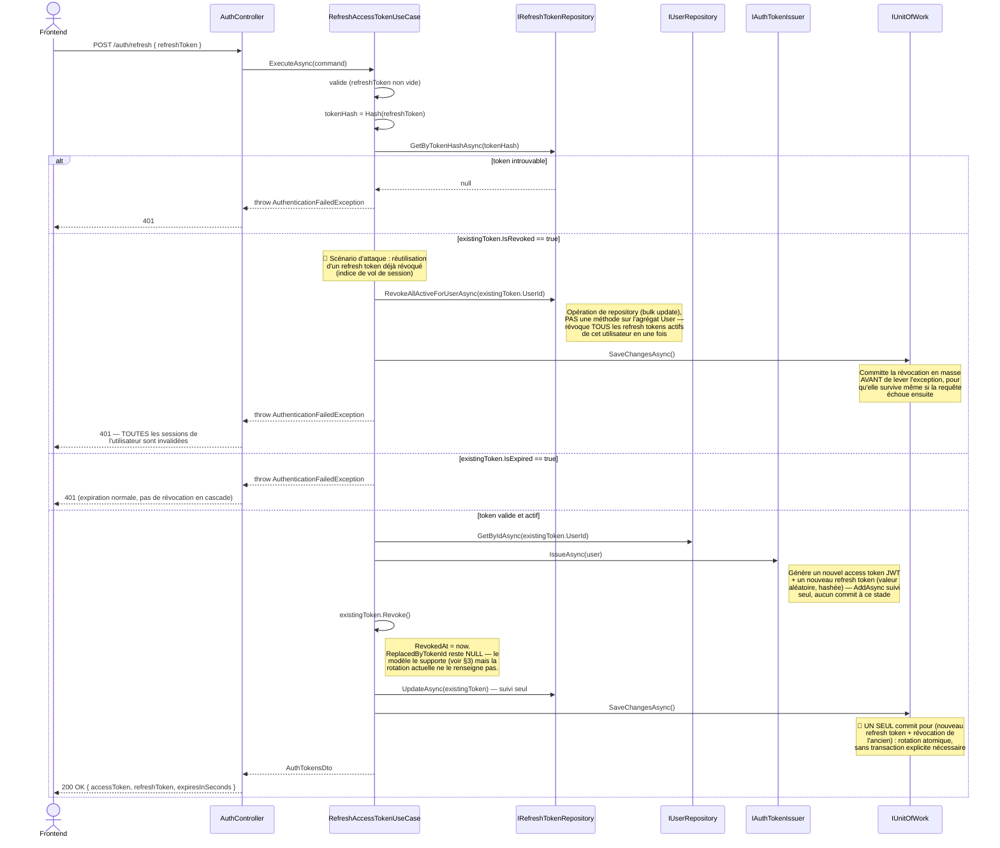
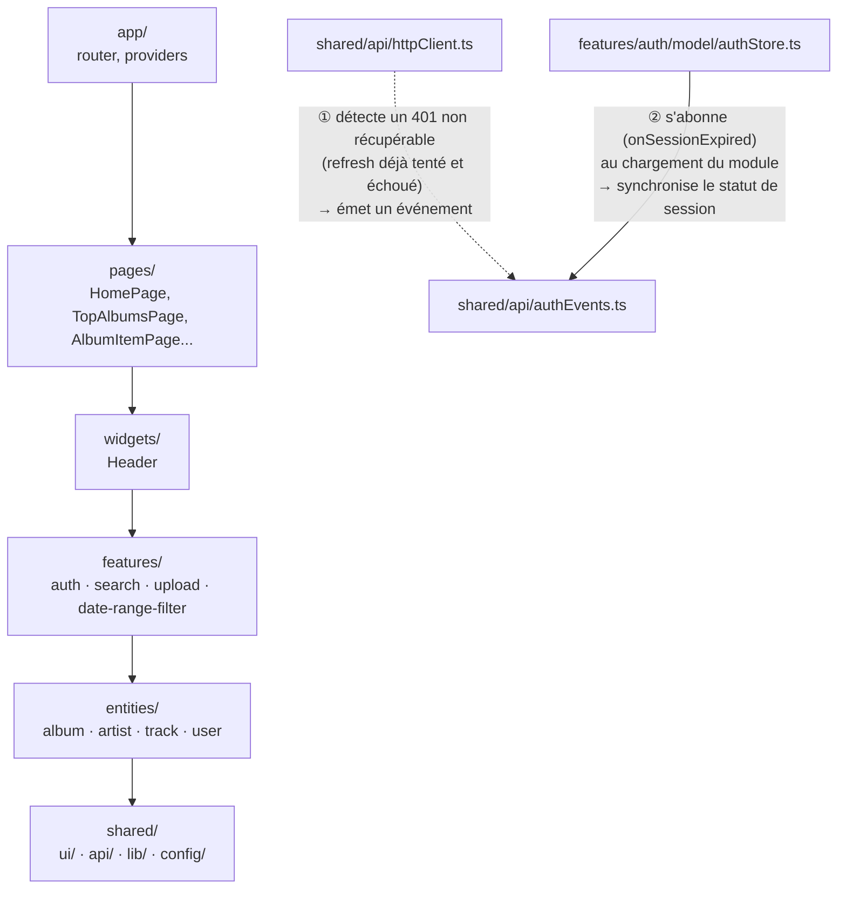

# Deezer Stats — Diagrammes d'architecture

> Complète [`TECHNICAL.md`](../TECHNICAL.md) avec des schémas visuels. Chaque diagramme a été
> vérifié contre le code réel (pas seulement contre l'intention initiale) — certains détails
> corrigent une hypothèse raisonnable mais inexacte sur l'implémentation ; ces corrections sont
> signalées explicitement, car ce sont précisément les pièges à éviter en onboarding.
>
> Chaque diagramme est fourni en image [`svg/`](./svg) (rendu pré-généré, thème et espacement
> volontairement épurés pour la lecture — le rendu Mermaid par défaut de GitHub ne reprend pas ces
> réglages) avec sa source Mermaid éditable repliée juste en dessous.

## 1. Contexte + Conteneurs (C4 niveaux 1 & 2)



Source Mermaid


```mermaid
flowchart TB
    User(["👤 Utilisateur<br/>(navigateur)"])

    subgraph sys["Deezer Stats"]
        direction TB
        FE["Frontend SPA<br/>React 19 + TypeScript<br/>port 5173"]
        API["Backend API<br/>.NET 10 / ASP.NET Core<br/>expose /api/v1 — port 5231"]
        DB[("PostgreSQL 17<br/>données transactionnelles<br/>+ cache pochettes/durées Deezer")]
        SEARCH[("Meilisearch<br/>index full-text<br/>albums / artistes / morceaux")]
    end

    DEEZER(["Deezer Public API<br/>(externe)<br/>métadonnées catalogue"])

    User -- HTTPS --> FE
    FE -- "JSON, JWT Bearer<br/>/api/v1/*" --> API
    API -- "EF Core / Npgsql" --> DB
    API -- "recherche + indexation (HTTP)" --> SEARCH
    API -- "métadonnées (HTTP, retry Polly)" --> DEEZER

    API -.->|"① Import (POST /imports) :<br/>écrit en DB (1 transaction),<br/>PUIS réindexe (appel groupé,<br/>best-effort, jamais bloquant)"| SEARCH
    API -.->|"② Enrichissement à la demande :<br/>lit Deezer SI pas déjà en cache,<br/>PUIS met à jour DB + réindexe"| DEEZER
```

- Les flèches pleines représentent la structure (qui parle à qui). Les flèches pointillées
  numérotées ① et ② superposent le **comportement** demandé — détaillé pas à pas dans les
  diagrammes [§4](#4-séquence--import-avec-unit-of-work) et [§5](#5-séquence--enrichissement-à-la-demande-avec-parallélisme).
  Pour le détail des composants internes du conteneur "Backend API", voir [§2](#2-composants-du-backend-c4-niveau-3).
- Meilisearch et PostgreSQL ne se parlent jamais directement : c'est toujours l'API qui orchestre
  les deux (jamais de synchronisation DB → Meilisearch en dehors d'un appel explicite de l'API).
- Un échec Meilisearch (indisponible, timeout) est absorbé et journalisé : PostgreSQL reste la
  source de vérité, une panne de recherche ne fait jamais échouer un import ou une consultation.

## 2. Composants du backend (C4 niveau 3)

Zoom sur le conteneur "Backend API" du diagramme précédent : l'architecture hexagonale
(ports & adapters) en une seule vue, groupée par responsabilité plutôt que classe par classe
(~80 fichiers dans le backend — voir `TECHNICAL.md` pour le détail exhaustif par dossier).



Source Mermaid


```mermaid
flowchart TB
    subgraph API_L["DeezerStats.Api"]
        direction LR
        PROG["Program.cs<br/>composition root — DI, pipeline HTTP"]
        MW["ExceptionHandlingMiddleware<br/>→ ProblemDetails"]
        CTRL["Contrôleurs<br/>Auth · Stats · Albums · Artists · Tracks<br/>History · Search · Imports"]
    end

    subgraph APP_L["DeezerStats.Application — zéro référence EF Core"]
        direction LR
        UC["Use Cases<br/>Auth · Import · Consultation<br/>Enrichissement à la demande · Recherche"]
        PORTS["Ports (interfaces)<br/>Repositories · IUnitOfWork<br/>IDeezerEnrichmentPort · ISearchEnginePort<br/>IExcelParserPort · Sécurité"]
        VALID["Validation<br/>FluentValidation"]
    end

    subgraph INFRA_L["DeezerStats.Infrastructure"]
        direction LR
        PERSIST["Persistence<br/>ApplicationDbContext · Repositories EF<br/>UnitOfWork · ListeningStatsQueryService"]
        ADAPT["Adapters<br/>Deezer (HTTP+Polly) · Meilisearch<br/>ClosedXML · BCrypt/JWT<br/>CatalogEnrichmentCoordinator"]
    end

    subgraph DOM_L["DeezerStats.Domain — zéro dépendance externe"]
        direction LR
        AGG["Agrégats<br/>User · RefreshToken · Artist<br/>Album · Track · ListeningEvent"]
        VO["Value Objects<br/>Email · Isrc · Duration · DateRange"]
    end

    DB[("PostgreSQL")]
    SEARCH[("Meilisearch")]
    DEEZER(["Deezer Public API"])

    CTRL --> UC
    MW -.->|traduit les exceptions| CTRL
    PROG -.->|"résout par DI<br/>(lie Adapters aux Ports)"| PORTS

    UC --> PORTS
    UC --> VALID
    UC --> AGG

    PERSIST -.->|implémente| PORTS
    ADAPT -.->|implémente| PORTS

    PERSIST --> AGG
    PERSIST --> VO
    PERSIST --> DB
    ADAPT --> SEARCH
    ADAPT --> DEEZER

    AGG --> VO

    classDef layer fill:transparent,stroke-width:1px
    class API_L,APP_L,INFRA_L,DOM_L layer
```

- **Flèches pleines = référence de code (compile-time)**, à sens unique dans un seul sens :
  `Api → Infrastructure/Application → Domain`. Vérifié empiriquement sur les `.csproj` (voir
  `TECHNICAL.md` §3) : `Application` ne référence aucun package EF Core, `Domain` ne référence
  rien du tout.
- **Flèches pointillées "implémente" = inversion de dépendance**, le cœur du pattern hexagonal :
  `Application` définit les Ports (interfaces `IAlbumRepository`, `IDeezerEnrichmentPort`, etc.)
  sans savoir qui les implémente ; `Infrastructure` les implémente concrètement
  (`AlbumRepository`, `DeezerHttpEnrichmentAdapter`...). `Program.cs` est le seul endroit qui
  connaît les deux côtés à la fois : c'est lui qui enregistre chaque implémentation
  `Infrastructure` derrière son interface `Application` dans le conteneur DI.
- Les Use Cases ne connaissent jamais une classe concrète d'`Infrastructure` — ils ne dépendent
  que des Ports. C'est ce qui permet de les tester unitairement sans base de données ni Meilisearch
  ni appel réseau (voir les 78 tests `Application.UnitTests`), et ce qui rendrait un changement de
  SGBD ou de moteur de recherche théoriquement transparent pour la couche métier.
- `CatalogEnrichmentCoordinator` est classé dans `Adapters` (pas dans `Persistence`) : il
  implémente `ICatalogEnrichmentCoordinator` (un Port `Application`) mais orchestre à la fois des
  Use Cases `GetOrEnrichXUseCase` et `ISearchEnginePort` — voir [§5](#5-séquence--enrichissement-à-la-demande-avec-parallélisme)
  pour le détail de cette orchestration.

## 3. Modèle de données du Domain (ERD)



Source Mermaid


```mermaid
erDiagram
    USER ||--o{ REFRESH_TOKEN : "UserId (FK réelle, cascade delete)"
    USER ||--o{ LISTENING_EVENT : "UserId"
    ARTIST ||--o{ ALBUM : "ArtistId"
    ARTIST ||--o{ TRACK : "ArtistId (artiste PRINCIPAL uniquement)"
    ALBUM ||--o{ TRACK : "AlbumId"
    TRACK ||--o{ LISTENING_EVENT : "TrackId"

    USER {
        guid Id PK
        string Email UK "value object"
        string PasswordHash
        string DisplayName
        datetime CreatedAt
    }

    REFRESH_TOKEN {
        guid Id PK
        guid UserId FK
        string TokenHash UK "jamais la valeur brute"
        datetime ExpiresAt
        datetime RevokedAt "nullable"
        guid ReplacedByTokenId "nullable — supporté par le modèle mais PAS renseigné par la rotation actuelle, voir §6"
    }

    ARTIST {
        guid Id PK
        string Name
        string NormalizedName UK
        string CoverUrl "nullable"
    }

    ALBUM {
        guid Id PK
        string Title
        string NormalizedTitle "UK composite avec ArtistId"
        guid ArtistId FK
        string CoverUrl "nullable"
        date ReleaseDate "nullable"
        int Duration "nullable, secondes"
    }

    TRACK {
        guid Id PK
        string Isrc UK
        string Title
        guid ArtistId FK "artiste PRINCIPAL uniquement"
        guid AlbumId FK
        string FeaturedArtists "nullable, TEXTE LIBRE — pas de relation, pas d'entité Featuring"
        int Duration "nullable, secondes"
        string CoverUrl "nullable"
    }

    LISTENING_EVENT {
        guid Id PK
        guid UserId FK
        guid TrackId FK
        int ListeningDuration "secondes"
        datetime ListenedAt "UK composite avec UserId+TrackId"
    }
```

Notation ERD limitée (pas de colonnes calculées) : quatre points ne peuvent pas être représentés
directement dans le schéma ci-dessus mais sont essentiels à comprendre :

- **`RefreshToken` ↔ `User` — relation "faible" volontaire.** La FK existe bien en base
  (`UserId`, `OnDelete(Cascade)`), mais **sans navigation property des deux côtés**
  (`HasOne<User>().WithMany()`, sans collection `User.RefreshTokens`). Impossible de faire
  `user.RefreshTokens` en C# : `RefreshToken` se recherche uniquement par son propre id fonctionnel
  (`TokenHash`, indexé unique) sans jamais charger l'agrégat `User`. Ce même style FK-sans-navigation
  est en fait utilisé partout dans le schéma (`Track → Artist`, `Track → Album` aussi) — c'est la
  convention EF Core de ce projet, pas un cas isolé.
- **`Track.FeaturedArtists` est un `string?` en texte libre, pas une relation.** Seul le premier nom
  de la colonne "artiste" de l'export Deezer (`ArtistId`) détermine l'artiste et l'album réels du
  morceau ; les featurings éventuels (ex. `"Future"` pour une ligne créditée `"The Weeknd, Future"`)
  sont conservés tels quels pour l'affichage uniquement. Aucune entité `Featuring` n'existe : ça
  évitait qu'un même album ne se retrouve fragmenté en plusieurs entités selon les featurings de
  chaque morceau (incident réel rencontré en développement, voir commentaire du code).
- **`ListeningEvent` a une clé alternative composite `(UserId, TrackId, ListenedAt)`**
  (`HasAlternateKey`, donc un vrai index unique en base, pas qu'une convention applicative) : c'est
  ce qui permet à l'import de détecter une ligne déjà connue sans dédoublonnage manuel — une
  tentative d'insertion en double violerait directement la contrainte.
- **`IsEnriched` est une propriété C# calculée, jamais une colonne persistée** :
  - `Album.IsEnriched` = `CoverUrl != null ET ReleaseDate != null ET Duration != null`
  - `Track.IsEnriched` = `Duration != null ET CoverUrl != null`
  - `Artist.IsEnriched` = `CoverUrl != null` (un artiste n'a ni durée ni date de sortie)

  C'est cette propriété qui décide, dans chaque `GetOrEnrichXUseCase`, s'il faut ou non appeler
  l'API Deezer (cache-first) — voir [§5](#5-séquence--enrichissement-à-la-demande-avec-parallélisme).

## 4. Séquence — Import (avec Unit of Work)



Source Mermaid


```mermaid
sequenceDiagram
    actor FE as Frontend
    participant API as ImportsController
    participant UC as ImportListeningHistoryUseCase
    participant Parser as ClosedXmlExcelParser
    participant Repos as Repositories<br/>(Track/Artist/Album/ListeningEvent)
    participant UoW as IUnitOfWork
    participant Search as ISearchEnginePort<br/>(Meilisearch)

    FE->>API: POST /imports (multipart .xlsx)
    API->>UC: ExecuteAsync(command)

    UC->>Parser: ParseHistoryAsync(fileStream)
    note right of Parser: Charge tout le classeur en mémoire<br/>(ClosedXML) puis retourne toutes<br/>les lignes d'un coup — PAS un<br/>vrai streaming ligne à ligne
    Parser-->>UC: toutes les lignes brutes

    UC->>UC: valide le format ISRC de chaque ligne (en mémoire)<br/>lignes invalides → erreurs, isolées tout de suite

    UC->>Repos: GetByIsrcsAsync(ISRC distincts)
    UC->>Repos: GetExistingListenedAtsAsync(userId, trackIds existants)
    UC->>Repos: GetByNamesAsync / GetByArtistIdsAsync (artistes/albums existants)
    note right of Repos: Bornés par le nombre d'entités<br/>DISTINCTES du fichier, pas par<br/>son nombre de lignes (~50k lignes<br/>→ quelques requêtes, pas 50k)

    loop pour chaque ligne valide
        UC->>UC: résout/crée Artist, Album, Track,<br/>ListeningEvent EN MÉMOIRE
        note right of UC: Skip si doublon (déjà en base<br/>OU déjà vu dans ce fichier)<br/>— AUCUN accès base ici
    end

    UC->>Repos: AddRangeAsync(newArtists/newAlbums/newTracks/newEvents)
    note right of Repos: Suivi par le ChangeTracker<br/>UNIQUEMENT — pas de commit

    UC->>UoW: SaveChangesAsync()
    note over UoW: 🔑 UN SEUL commit pour tout le lot :<br/>1 transaction atomique. Un échec<br/>n'insère jamais un artiste/album<br/>orphelin sans ses morceaux/écoutes.

    UC->>Search: IndexDocumentsAsync(documents des nouvelles entités)
    note right of Search: 1 seul appel groupé, best-effort :<br/>une panne Meilisearch est journalisée<br/>et absorbée — Postgres est déjà la<br/>source de vérité à ce stade, l'import<br/>ne doit jamais échouer pour ça

    UC-->>API: ImportReport(imported/skipped/errorCount, errors)
    API-->>FE: 200 OK
```

**Le point à ne jamais casser** : `AddRangeAsync` ne fait que suivre les entités (aucun accès
base). Le `SaveChangesAsync()` de l'étape ci-dessus est **le seul et unique commit de tout le use
case** — ajouter un `SaveChanges` à l'intérieur de la boucle romprait l'atomicité (un artiste
pourrait être committé sans ses albums/morceaux si une ligne suivante échoue) et réintroduirait un
aller-retour base par ligne, exactement le problème de perf qui a fait abandonner l'enrichissement
synchrone à l'import (voir `PLAN.md`, ticket 8.3).

## 5. Séquence — Enrichissement "à la demande" (avec parallélisme)



Source Mermaid


```mermaid
sequenceDiagram
    actor FE as Frontend
    participant API as AlbumsController
    participant UC as GetTopAlbumsUseCase
    participant Query as IListeningStatsQueryPort<br/>(SQL)
    participant Helper as CoverEnrichmentHelper
    participant Coord as CatalogEnrichmentCoordinator
    participant Search as ISearchEnginePort<br/>(Meilisearch)

    FE->>API: GET /albums/top
    API->>UC: ExecuteAsync(query)
    UC->>Query: GetTopAlbumsAsync(...)
    Query-->>UC: page d'AlbumSummary (CoverUrl parfois null)

    UC->>Helper: EnrichCoversAsync(items, coordinator)
    Helper->>Helper: filtre les items où CoverUrl == null

    alt aucun item à enrichir
        Helper-->>UC: items inchangés
    else des items à enrichir
        Helper->>Coord: EnrichAlbumsAsync(ids à enrichir)

        par Parallel.ForEachAsync — concurrence bornée à 10
            Coord->>Coord: CreateScope() — 1 IServiceScope PAR ÉLÉMENT
            note right of Coord: 🔑 DbContext Scoped = pas thread-safe.<br/>Impossible de partager un seul<br/>DbContext/UnitOfWork entre les<br/>tâches parallèles → 1 scope isolé<br/>(donc 1 DbContext isolé) par album.
            Coord->>Coord: GetOrEnrichAlbumUseCase.ExecuteAsync(albumId)<br/>[dans ce scope isolé]
            Coord->>Coord: GetByIdAsync(albumId) — lecture via CE DbContext
            alt déjà IsEnriched
                Coord->>Coord: retourne tel quel, aucun appel réseau
            else pas encore enrichi
                Coord->>Coord: FetchAlbumMetadataAsync(titre, artiste)<br/>[Polly : retry + timeout]
                Coord->>Coord: album.Enrich(cover, releaseDate, duration)
                Coord->>Coord: UpdateAsync(album) — suivi seul
                Coord->>Coord: SaveChangesAsync()
                note right of Coord: ⚠️ Commit ISOLÉ à CET album,<br/>dans SA transaction propre.<br/>PAS un SaveChanges groupé à la fin —<br/>chaque scope committe pour lui-même,<br/>précisément parce que les scopes<br/>sont isolés (voir note ci-dessus).
            end
            alt erreur (Deezer indisponible, élément supprimé...)
                Coord->>Coord: journalise, absorbe
                note right of Coord: N'affecte JAMAIS les autres<br/>éléments de la boucle parallèle
            end
        end

        Coord->>Search: IndexDocumentsAsync(tous les documents fraîchement enrichis)
        note right of Search: 🔑 Ici oui, UN SEUL appel groupé —<br/>mais seulement après que TOUTE<br/>la boucle parallèle est terminée.<br/>C'est la réindexation qui est batchée,<br/>pas la persistance PostgreSQL.
        Coord-->>Helper: dictionnaire (albumId -> coverUrl fraîche)
        Helper->>Helper: reporte les covers fraîches sur la liste<br/>déjà obtenue (titre/artiste/compteur inchangés)
        Helper-->>UC: liste enrichie
    end

    UC-->>API: PagedResult d'AlbumSummary
    API-->>FE: 200 OK (avec les nouvelles pochettes)
```

**Correction importante par rapport à une hypothèse naturelle mais fausse** : il n'y a **pas** un
seul `SaveChangesAsync` groupé à la fin pour tous les albums enrichis — c'est l'inverse. Chaque
élément de la boucle parallèle committe **sa propre** transaction dans **son propre** `DbContext`
scope, précisément parce que ces scopes sont isolés pour la thread-safety (un `DbContext` Scoped
ne peut pas être partagé entre threads). La **seule** chose réellement groupée en un seul appel
après la boucle, c'est la réindexation Meilisearch (`ReindexAsync`, qui accumule les documents des
éléments enrichis avec succès dans un `ConcurrentBag` pendant la boucle, puis les envoie en un
seul appel HTTP une fois la boucle terminée).

## 6. Séquence — Rotation des refresh tokens



Source Mermaid


```mermaid
sequenceDiagram
    actor FE as Frontend
    participant API as AuthController
    participant UC as RefreshAccessTokenUseCase
    participant RT as IRefreshTokenRepository
    participant UserRepo as IUserRepository
    participant Issuer as IAuthTokenIssuer
    participant UoW as IUnitOfWork

    FE->>API: POST /auth/refresh { refreshToken }
    API->>UC: ExecuteAsync(command)
    UC->>UC: valide (refreshToken non vide)
    UC->>UC: tokenHash = Hash(refreshToken)
    UC->>RT: GetByTokenHashAsync(tokenHash)

    alt token introuvable
        RT-->>UC: null
        UC-->>API: throw AuthenticationFailedException
        API-->>FE: 401
    else existingToken.IsRevoked == true
        note over UC: 🚨 Scénario d'attaque : réutilisation<br/>d'un refresh token déjà révoqué<br/>(indice de vol de session)
        UC->>RT: RevokeAllActiveForUserAsync(existingToken.UserId)
        note right of RT: Opération de repository (bulk update),<br/>PAS une méthode sur l'agrégat User —<br/>révoque TOUS les refresh tokens actifs<br/>de cet utilisateur en une fois
        UC->>UoW: SaveChangesAsync()
        note over UoW: Committe la révocation en masse<br/>AVANT de lever l'exception, pour<br/>qu'elle survive même si la requête<br/>échoue ensuite
        UC-->>API: throw AuthenticationFailedException
        API-->>FE: 401 — TOUTES les sessions de<br/>l'utilisateur sont invalidées
    else existingToken.IsExpired == true
        UC-->>API: throw AuthenticationFailedException
        API-->>FE: 401 (expiration normale, pas de révocation en cascade)
    else token valide et actif
        UC->>UserRepo: GetByIdAsync(existingToken.UserId)
        UC->>Issuer: IssueAsync(user)
        note right of Issuer: Génère un nouvel access token JWT<br/>+ un nouveau refresh token (valeur<br/>aléatoire, hashée) — AddAsync suivi<br/>seul, aucun commit à ce stade
        UC->>UC: existingToken.Revoke()
        note right of UC: RevokedAt = now.<br/>ReplacedByTokenId reste NULL — le<br/>modèle le supporte (voir §3) mais la<br/>rotation actuelle ne le renseigne pas.
        UC->>RT: UpdateAsync(existingToken) — suivi seul
        UC->>UoW: SaveChangesAsync()
        note over UoW: 🔑 UN SEUL commit pour (nouveau<br/>refresh token + révocation de<br/>l'ancien) : rotation atomique,<br/>sans transaction explicite nécessaire
        UC-->>API: AuthTokensDto
        API-->>FE: 200 OK { accessToken, refreshToken, expiresInSeconds }
    end
```

**Détecter la réutilisation** ne repose que sur `existingToken.IsRevoked` (`RevokedAt.HasValue`) —
pas sur une combinaison avec `ReplacedByTokenId` comme on pourrait le supposer en lisant le nom du
champ : ce champ existe dans le modèle (pour tracer la chaîne de rotation en cas d'investigation)
mais **n'est actuellement jamais renseigné** par `RefreshAccessTokenUseCase` (`existingToken.Revoke()`
est appelé sans argument). La détection de vol de session ne dépend donc que d'un seul état
booléen, ce qui la rend simple à raisonner mais signifie aussi qu'on ne peut pas aujourd'hui
distinguer "révoqué par rotation normale" de "révoqué explicitement par logout" en rejouant la
chaîne — les deux ont exactement le même effet (`IsRevoked == true`).

## 7. Dépendances Frontend (Feature-Sliced Design + pub/sub)



Source Mermaid


```mermaid
flowchart TD
    L1["app/<br/>router, providers"]
    L2["pages/<br/>HomePage, TopAlbumsPage, AlbumItemPage..."]
    L3["widgets/<br/>Header"]
    L4["features/<br/>auth · search · upload · date-range-filter"]
    L5["entities/<br/>album · artist · track · user"]
    L6["shared/<br/>ui/ · api/ · lib/ · config/"]

    L1 --> L2 --> L3 --> L4 --> L5 --> L6

    HC["shared/api/httpClient.ts"]
    EV["shared/api/authEvents.ts"]
    AS["features/auth/model/authStore.ts"]

    HC -. "① détecte un 401 non récupérable<br/>(refresh déjà tenté et échoué)<br/>→ émet un événement" .-> EV
    AS -- "② s'abonne (onSessionExpired)<br/>au chargement du module<br/>→ synchronise le statut de session" --> EV
```

**Pourquoi cet aller-détour plutôt qu'un import direct** : la règle FSD de ce projet est stricte
— une couche ne dépend que des couches en dessous d'elle, et `shared/` est la couche la plus
basse. Si `httpClient.ts` (dans `shared/`) importait directement `authStore` (dans `features/`)
pour le mettre à jour sur un 401, ce serait une dépendance **remontante** (`shared` → `features`),
qui casse la règle et empêcherait `shared/` d'être réutilisable indépendamment de la logique
d'auth. À la place, `httpClient` **émet** un événement générique via `authEvents.ts` (qui reste
dans `shared/`, donc aucune dépendance remontante) sans savoir qui écoute ; `authStore`
**s'abonne** à cet événement — ce qui est une dépendance descendante tout à fait normale
(`features` → `shared`). Le flux d'information remonte bien de `shared` vers `features`, mais
aucune ligne de code de `shared/` ne référence jamais `features/`.

